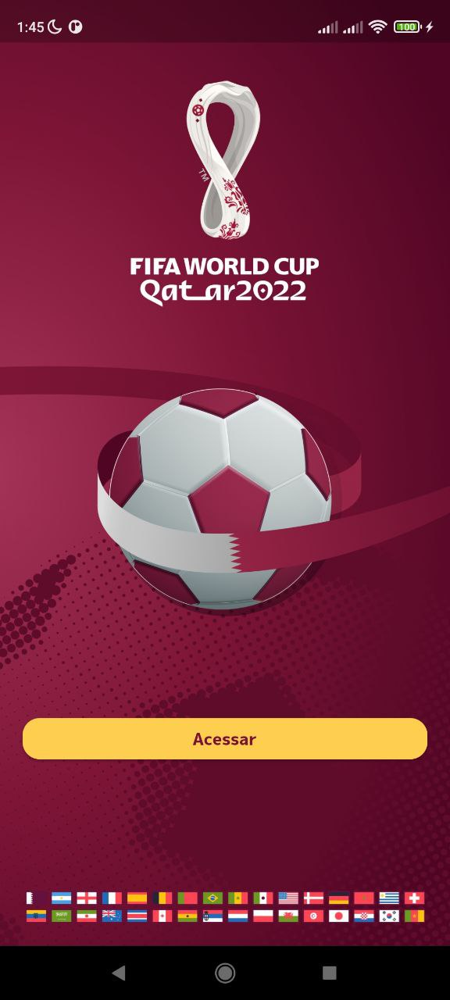
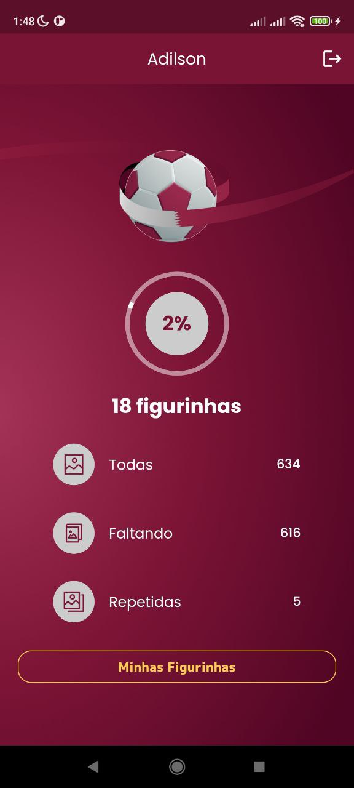
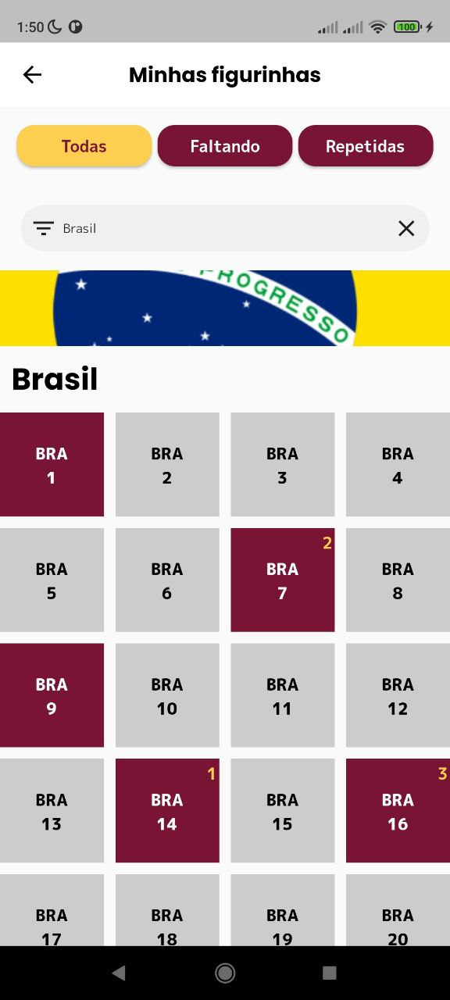
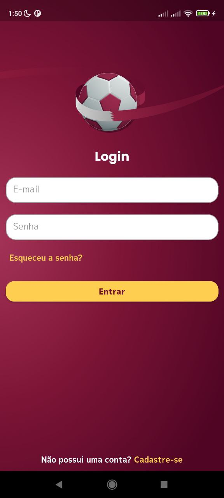
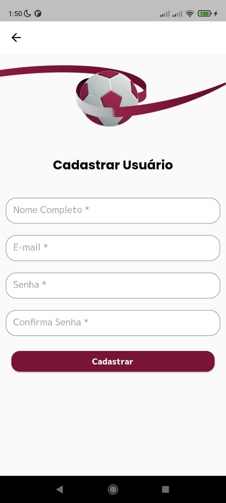

# Figurinhas Copa 2022 - Flutter

Projeto desenvolvido para participar do evento Dart Week (Academia do Flutter),
afim de realizar um imersão em Flutter, colocando em prática a arquitetura MVP e vários outros conceitos.

## Screenshots

  
    
    
    
    

## Packages utilizados

Foram utilizados os packages abaixo para auxiliar na construção do projeto:

- top_snackbar_flutter: ^2.1.1
- loading_animation_widget: ^1.2.0+3
- flutter_getit: ^1.2.1
- flutter_dotenv: ^5.0.2
- dio: ^4.0.6
- validatorless: ^1.2.1
- shared_preferences: ^2.0.15
- flutter_awesome_select: ^6.5.0
